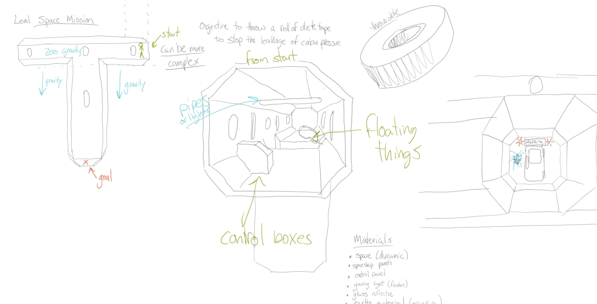
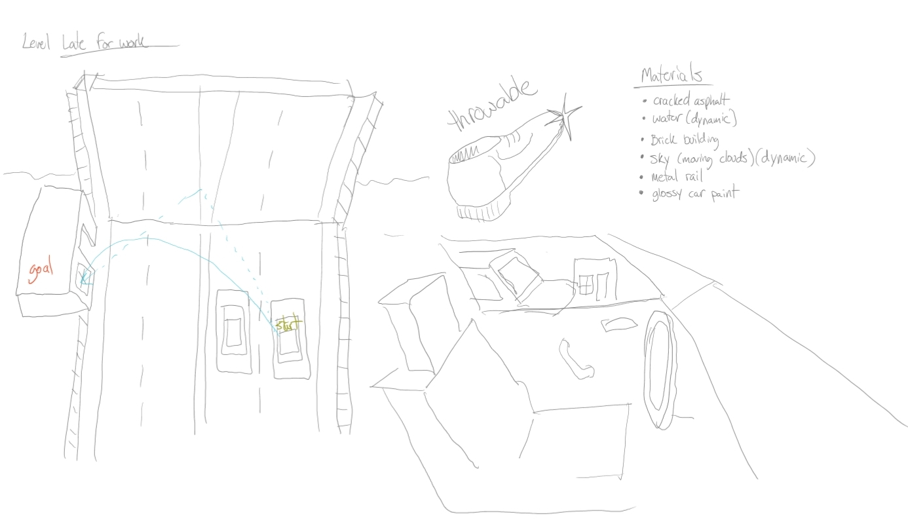
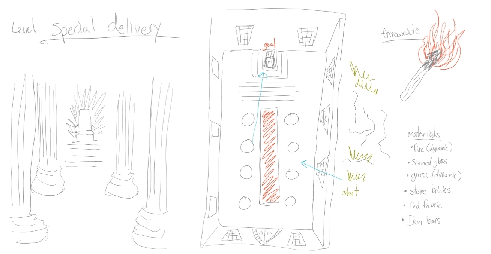
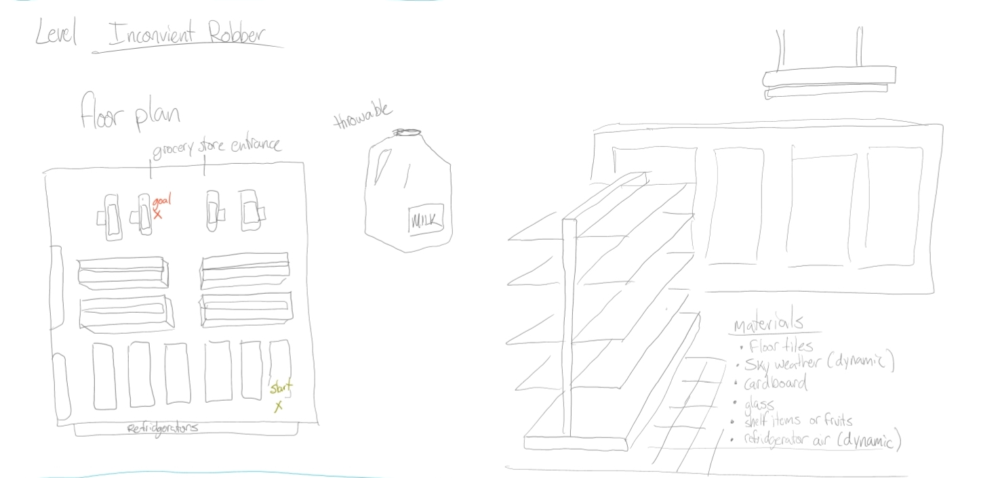

# Mirus-Shot
A multi level puzzle game where you propel a projectile on a trajectory, towards a goal. Rebounds and utilization of the environment will help you reach this goal.
There will be an initial starting position where the player will throw from.
If your projectile misses the goal you start from the point where the projectile hits the ground, progressing you towards (or away from) the goal.
Each level has a puzzle component which impacts your strategy for accomplishing the goal. Your score is tracked throughout every level. The objective is to obtain the best score on the leaderboard.
The theme is surreal, wacky and unpredictable.

## How to play

## Details

- Audience: 7 years and older  
- Genre: Sports, Puzzle, Strategy, First Person  
- Players: 1  
- Platform: PC
- Map: Hybrid  
- No. of Levels: 5

## Concept Drawings

## Contributors
- Bryan Dedeurwaerder (project manager)    
- Taiga Miyano (gameplay programmer)  
- Alton Prentice  (lead level designer)    
- Matthew Alighchi (lead UI/UX artist)

## Meta Data
Unreal Version 4.22.3
